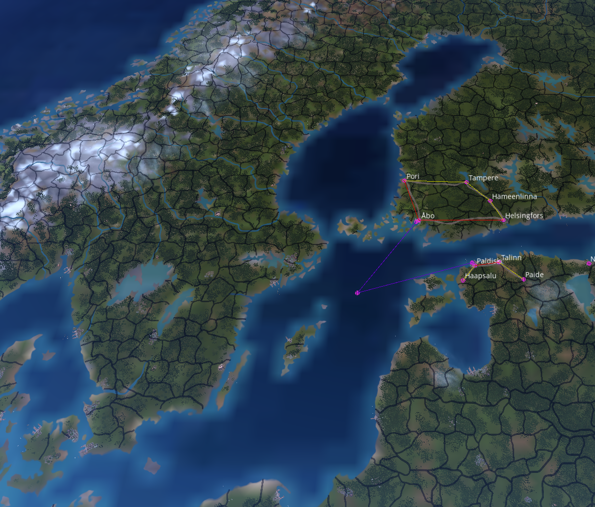

# Victoria 3 Map Utilities

A utility for manipulating and managing splnet files for Victoria 3

When developing my own mod for Victoria 3 I realized that any edits I made to the spline network would be need to be
redone when 1.8 released. This tool was developed to deal with that, tracking just the edits made to the network, and
applying them to a new version of the file. After that was developed it became clear that the code could be expanded to
help with other tasks involving the very opaque splnet file.

Most significantly this utility can merge network edits by multiple contributors, allowing multiple contributor to work
on the network at the same time.

## Download

Downloads are hosted on the GitHub [Releases](https://github.com/Lunar-Dawn/Vic3MapUtils/releases) page.

## Usage

This utility can perform three tasks, edit merging, version transferal, and full merging. These will be
explained separately.

More complete explanations of the command syntax can be found by running.

```shell
./Vic3MapUtils help
```

### Edit Merging

#### Command

```shell
./Vic3MapUtils merge <base_network> <edited_network> <edited_network>...
```

#### Description

Likely the most useful current feature for most people, this command merges the edits to several networks as compared to
a base network. This is designed for multi-contributor mods where, without such a tool, only one person can work on the
spline network at a time. With this utility their edits can simply be merged on top of the base network.

Note also, that if you use the Vanilla network as the base, this could make a compatch network for two mods that both
edit the
vanilla network in different parts of the world.

#### Example

Found in [example_networks](README/example_networks), these toy examples demonstrate a hypothetical edit conflict, where
one mapper has added Svealand and edited Estland (edit_1), and another has added Norrland and edited Uusimaa (edit_2).
This
tool can merge these edits, allowing something akin to a merge commit with the following command:

```shell
./Vic3MapUtils merge -o edit_merged.splnet edit_base.splnet edit_1.splnet edit_2.splnet
```

|                   **edit_base.splnet**                    |                          **edit_1.splnet**                          |
|:---------------------------------------------------------:|:-------------------------------------------------------------------:|
|      |            |
|                     **edit_2.splnet**                     |                       **edit_merged.splnet**                        |
|  |  |

### Version Transferal

#### Command

```shell
./Vic3MapUtils generate <old_base> <your_network>
./Vic3MapUtils apply -o out.splnet <new_base> diff.json
```

#### Description

The original raison d'être of this tool, the `generate` and `apply` commands allow you to transfer your mod that edits
the
vanilla spline network across Victoria 3 versions. Useful for mods that *edit* the world map, but don't *replace* it,
such as mine (release pending).
Otherwise, you'd have to redo your work every update.

Start by running the `generate` command, supplying the old vanilla network and your mod's network. This will give you a
json file
containing the differences between your network and the vanilla one. Then, update your game and run the `apply` command,
supplying the
new vanilla network and the previously-generated json file. This will apply the edits to the new network, and you should
be clear to put it into you mod.

Note, anytime I referred to the "vanilla network", it could just as well be two different version of Anbennar, Exether,
or some other total overhaul for the purposes of a submod.

### Full Merges

#### Command

```shell
./Vic3MapUtils full-merge <network> <network>...
```

#### Description

Useful for merging completely independent work by different mappers, e.g. when making a new overhaul mod and
independently starting
the network in two different parts of the world, this command will completely merge the two networks into one.

#### Example

Found in [example_networks](README/example_networks), these examples use just the additions from the Edit Merging
examples, merging the added Svealand and Norrland into one network.

```shell
./Vic3MapUtils full-merge -o standalone_merged.splnet standalone_1.splnet standalone_2.splnet
```

|                                                             |                        **standalone_1.splnet**                        |
|:-----------------------------------------------------------:|:---------------------------------------------------------------------:|
|                                                             |            |
|                   **standalone_2.splnet**                   |                     **standalone_merged.splnet**                      |
|  |  |

## An Explanation of the .splnet File Format

This project required me to reverse-engineer and learn everything I could about the .splnet files since we have no
formal spec. Soon™ I should be opening a thread on the Paradox Forums with an explanation of the format along with an
unofficial spec. But I wanted to release this since it's in a usable state now, and someone else might really need it.

Massive thanks to the great work of Pizza and Edouard_Saladier from
the [RandomParadox](https://github.com/panik4/RandomParadox) project for giving me a
jumping-off point to understand the
format, without them this would have taken much longer.

## Building

Vic3MapUtils is built with a standard cmake setup, running the following commands should build the project on most
Linux systems.

```shell
git clone https://github.com/Lunar-Dawn/Vic3MapUtils.git
cd Vic3MapUtils
mkdir build
cd build
cmake -DCMAKE_BUILD_TYPE=Release ..
make
```

(Since I don't have easy access to a Windows machine (release .exes are cross-compiled) I'm not 100% on the exact
commands for it, contributions are very welcome! Clion should work at least, since it's CMake based.)

## Contributing

Contributions are very welcome, just open an issue or PR. The only hard requirement is for any code to obey the
[clang-format](https://clang.llvm.org/docs/ClangFormat.html) rules specified in the project.

**Note that any bug reports without (if relevant) attached .splnet files or Victoria 3 versions (probably don't want to
distribute their files, be on the safe side) will be ignored.**

## TODO

- [ ] AppImage build for linux
- [ ] Argument parsing is currently very manual and could do with a rewrite, especially if new features are introduced.
- [ ] Several things might need sanity checking before being applied to a network, particularly concurrent edits.
- [ ] Errors and Warnings are currently very ad-hoc, a real logging system is needed.
- [ ] The great graph rewrite. In the beginning this project focused very hard on producing byte-identical files, this
  has become a hindrance. Currently, the network consists of three lists with no connection in code. Rewriting this into
  a real graph with Nodes and Edges would allow for many new features to be much easier to implement, such as component
  generation.

## Future Plans

Future plans, of varying ambition

- [ ] Do the same version-transferal for provinces.png as for the network.
- [ ] Move/place city/port/etc. locators under hubs automatically.
- [ ] Autogenerate localisation file lines for anchors.
- [ ] Generalise the code to work with more parts of the game files.
	- [ ] Break the functional code out into a separate library, allowing others to use them.
	- [ ] Parse Clausewitz script files

## Known issues

None (so far)
